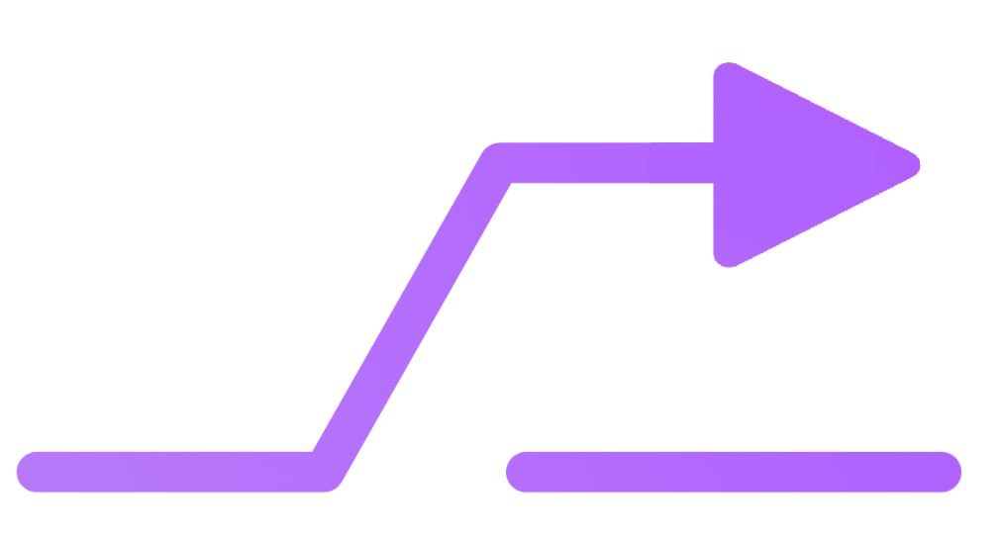
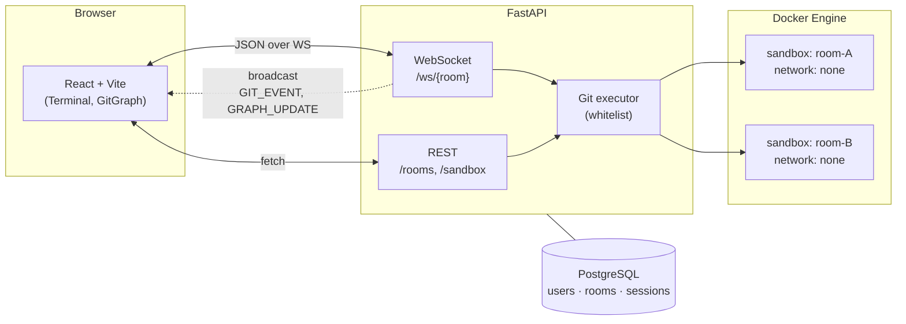

<p align="center">
  
</p>

<h1 align="center">Git Trainer</h1>

<p align="center">
  Інтерактивна багатокористувацька платформа для навчання Git
  з візуалізацією графу гілок у реальному часі.
</p>

<p align="center">
  
  
  
  
</p>

---

## Опис

Студенти, що вперше зустрічаються з Git, часто не розуміють, що саме відбувається
з графом гілок під час `merge`, `rebase`, `cherry-pick` чи `reset --hard`. Команди
виконуються «всліпу», а результат стає видимим лише після `git log --graph` —
і часто вже після того, як стан репозиторію зламано.

**Git Trainer** — інтерактивна навчальна платформа, де команда у терміналі і
візуалізація графу живуть поряд: кожен `commit`, `branch`, `merge` миттєво
відображається на канві (стиль GitKraken, темна мінімалістична тема). Робота
ведеться в ізольованому Docker-контейнері без мережі, тож зламати нічого
не можна — а будь-яке експериментальне рішення повторюється кнопкою
«reset».

Платформа підтримує **спільні кімнати**: викладач створює кімнату й ділиться
посиланням, студенти заходять і бачать дії одне одного в реальному часі через
WebSocket. Цільова аудиторія — студенти КПІ та користувачі курсів Git,
які потребують практики у безпечному середовищі.

## Архітектура



Кожна кімната — один sandbox-контейнер з bare Git-репозиторієм. Команди
проходять через whitelist, виконуються виключно всередині контейнера й
повертаються як події, що транслюються всім підключеним до кімнати клієнтам.

## Стек

| Шар        | Технологія                          | Чому саме воно                                       |
| ---------- | ----------------------------------- | ---------------------------------------------------- |
| Frontend   | React 19 · Vite · TypeScript        | Швидкий HMR, типобезпека, простий tooling.           |
| State      | Zustand                             | Мінімалістичний store без boilerplate Redux.         |
| Terminal   | xterm.js                            | Реалістична псевдо-консоль з історією та хоткеями.   |
| Graph      | Власний SVG-renderer (one-lane-per-branch) | Контроль над layout-ом, без import-важких бібліотек. |
| Backend    | FastAPI · async/await · WebSocket   | Async I/O, природна модель для broadcast-протоколу.  |
| DB         | SQLAlchemy 2.0 async · asyncpg/aiosqlite | Cross-DB (Postgres у prod, SQLite у dev/тестах).     |
| Schemas    | Pydantic v2                         | Спільна модель валідації для REST і WS.              |
| Sandbox    | Docker SDK (Python)                 | Ізоляція з `network: none`, `cap_drop: ALL`, lim-и.  |
| Tests      | pytest · pytest-asyncio · httpx     | Async-friendly, інтеграція з WS-клієнтом.            |

## Quick start

### Backend (Python 3.12)

```bash
cd backend
python -m venv .venv
source .venv/bin/activate   # Windows: .venv\Scripts\activate
pip install -r requirements.txt
uvicorn app.main:app --reload --port 8000
```

### Frontend (Node 20+)

```bash
cd frontend
npm install
npm run dev          # http://localhost:5173
```

### Docker (повна локальна збірка)

```bash
docker compose up --build       # backend + sandbox-image + frontend
docker compose down -v          # повне очищення
```

### Tests

```bash
cd backend && pytest -v         # 77+ async-тестів
cd frontend && npm run lint     # ESLint + react-hooks
```

## WebSocket протокол

Усі повідомлення — JSON, поле `type` ідентифікує подію.

```json
{ "type": "GIT_COMMAND", "payload": { "command": "git commit -m init" } }

{ "type": "GIT_EVENT", "action": "commit",
  "payload": { "hash": "abc123", "message": "init", "branch": "main", "author": "dzhe" } }

{ "type": "USER_JOINED", "user": { "id": "guest-x4k2m9", "username": "dzhe" } }
{ "type": "USER_LEFT",   "user": { "id": "guest-x4k2m9" } }

{ "type": "GRAPH_UPDATE",
  "graph": { "nodes": [/* {hash, parents, branch, message, author} */],
             "edges": [/* {from, to} */] } }

{ "type": "ERROR", "message": "command not allowed" }
```

| Подія           | Напрямок         | Призначення                                              |
| --------------- | ---------------- | -------------------------------------------------------- |
| `GIT_COMMAND`   | client → server  | Виконати команду в sandbox-контейнері кімнати.           |
| `GIT_EVENT`     | server → all     | Транслювати одиничну дію (commit/branch/merge).          |
| `GRAPH_UPDATE`  | server → all     | Надіслати повний знімок графу (також late-joiner-ам).    |
| `USER_JOINED`   | server → all     | Хтось підключився; додати до списку учасників.           |
| `USER_LEFT`     | server → all     | Хтось відключився.                                       |
| `ERROR`         | server → caller  | Команда заблокована whitelist-ом або впала з помилкою.   |

## Безпека

- Git-команди виконуються **виключно** всередині sandbox-контейнера через Docker SDK — ніколи на хості.
- Sandbox запускається з `network=none`, `cap_drop=ALL`, `--security-opt no-new-privileges`,
  `mem_limit=256m`, `pids_limit=128`.
- Усі команди перевіряються через **whitelist** (`git status`, `commit`, `branch`, `merge`, `rebase`, …)
  перед передачею в контейнер; решта блокується з `ERROR`.
- На рівні REST/WS — валідація через Pydantic; роботи з shell-ом немає.
- Усі помилки логуються з контекстом `room_id` + `user_id`.

## Структура проєкту

```
git-trainer/
├── backend/
│   ├── app/
│   │   ├── main.py            # FastAPI entrypoint, lifespan, CORS
│   │   ├── api/               # REST: /rooms (+ /sandbox reset)
│   │   ├── ws/                # WebSocket handlers + ConnectionManager
│   │   ├── git/               # parser, executor, whitelist
│   │   ├── docker/            # SandboxManager (start/stop/exec)
│   │   ├── db/                # async engine, session, repository
│   │   └── models/            # SQLAlchemy + Pydantic schemas
│   └── tests/                 # pytest + pytest-asyncio
├── frontend/
│   ├── public/logo.svg        # Бренд-лого (favicon + шапка)
│   └── src/
│       ├── App.tsx            # Landing ↔ Room роутинг
│       ├── components/
│       │   ├── Landing.tsx    # Стартова сторінка (нік + кімната)
│       │   ├── Room.tsx       # Шапка + Terminal + GitGraph
│       │   ├── Terminal.tsx   # xterm.js + хоткеї
│       │   └── GitGraph.tsx   # SVG-граф, one-lane-per-branch
│       ├── hooks/useWebSocket.ts
│       ├── store/gitStore.ts  # Zustand
│       └── lib/session.ts     # URL/localStorage helpers
├── docker/sandbox/            # Dockerfile для git-пісочниці
└── CLAUDE.md
```

## Дорожня карта

- ✅ **Фаза 1** — Backend skeleton (FastAPI + WS + ConnectionManager).
- ✅ **Фаза 2** — DB persistence (users · rooms · sessions, async SQLAlchemy).
- ✅ **Фаза 3** — UI polish (dark theme, GitKraken-style граф, editable fields, reset).
- ✅ **Фаза 4** — Landing, share-link, брендинг, README.
- ✅ **Фаза 5** — Docker sandbox integration: реальне виконання `git` у контейнері (`network=none`, whitelist, per-student author).
- ⬜ **Фаза 6** — Deployment: docker-compose у production, домен, HTTPS.

## Контекст

Проєкт є бакалаврською дипломною роботою на кафедрі АСОІУ
Національного технічного університету України «Київський політехнічний
інститут ім. Ігоря Сікорського», група ІМ-23. Захист — червень 2026.
Пріоритет — робочий MVP і чистота коду для демонстрації комісії.
